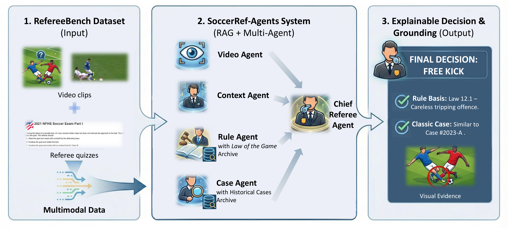
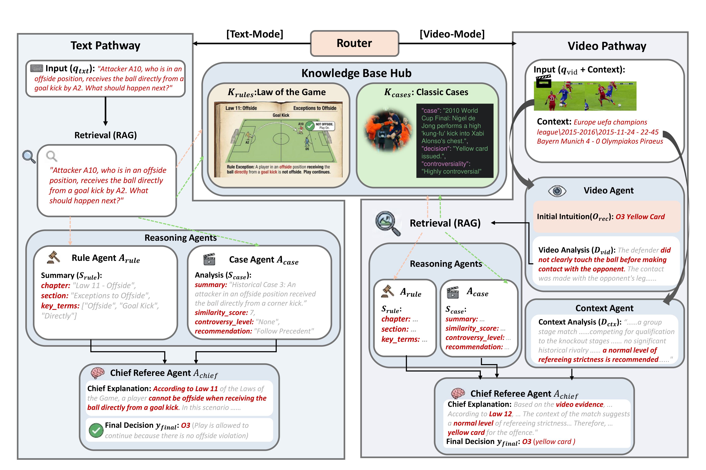

<div align="center">

# SoccerRef-Agents

**Multi-Agent System for Automated Soccer Refereeing**

[](https://www.python.org/downloads/)
[](LICENSE)

**Zi Meng** &middot; **Wanli Song** &middot; **Yi Hu** &middot; **Jiayuan Rao** &middot; **Gang Chen**

University of Michigan & Shanghai Jiao Tong University

[📄 Paper (PDF)](SoccerRef_Agents__Multi_Agent_System_for_Automated_Soccer_Refereeing.pdf) &nbsp;|&nbsp; [🌐 Project Page](https://github.com/yjlog/SoccerRef-Agents)

</div>

---

## Overview

**SoccerRef-Agents** is a holistic and explainable multi-agent decision-making framework for automated soccer refereeing. Unlike traditional black-box models, our system decomposes the officiating task into perception, retrieval, legal interpretation, and final adjudication — mimicking the collaborative workflow of a professional refereeing team. By leveraging a novel **cross-modal RAG** mechanism, the system bridges the semantic gap between visual footage and regulatory texts, providing decisions that are not only accurate but also legally grounded and explainable.

<p align="center">

</p>

## Key Features

- **SoccerRefBench** — A multimodal benchmark comprising **1,218 theoretical questions** (from CFA, NFHS, FHSAA exams) and **600 video judgment scenarios** (from SoccerNet-MVFoul), mapped to four severity levels: *No Offence*, *Normal Offence*, *Yellow Card*, *Red Card*.
- **RefKnowledgeDB** — A vector-based knowledge base containing the digitized *Laws of the Game (2025/26)* and 184 curated classic cases from elite leagues and the FIFA World Cup.
- **Multi-Agent Architecture** — Five specialized agents collaborate via cross-modal RAG:
  - 🎥 **Video Agent** — Visual perception and structured description.
  - ⚖️ **Rule Agent** — Legal interpretation via RAG over the *Laws of the Game*.
  - 📚 **Case Agent** — Historical precedent retrieval via CBR.
  - 🏟️ **Context Agent** — Match background and game-management analysis.
  - 👨‍⚖️ **Chief Referee Agent** — Final adjudication with legally grounded explanation.
- **Glass-Box Explainability** — Full reasoning traces (`agent_traces`) grounding every decision in specific rule clauses and historical precedents.

## System Workflow

<p align="center">

</p>

The system operates through two distinct reasoning pipelines based on input modality:

- **Text-Mode Pipeline** — The text query is used directly to retrieve relevant rules and cases. The Rule Agent and Case Agent produce specialist summaries, which the Chief Referee Agent synthesizes into a final ruling.
- **Video-Mode Pipeline** — The Video Agent converts visual content into a textual Video Analysis ($D_{vid}$), which drives cross-modal retrieval of rules and precedents. The Context Agent enriches the decision with match background. The Chief Referee Agent aggregates all evidence for final adjudication.

## Main Results

| Model | Text (%) | Video (%) | Overall (%) |
|:------|:--------:|:---------:|:-----------:|
| *Open-Source Models* | | | |
| Qwen3-VL-8B | 46.88 | 23.50 | 39.16 |
| Qwen3-VL-32B | 56.57 | 24.33 | 45.93 |
| DeepSeek-V3 | 65.35 | — | — |
| *Commercial APIs* | | | |
| Gemini 2.5 Flash | 69.38 | 26.33 | 55.17 |
| Claude 4.5 Sonnet | 65.19 | 34.67 | 55.12 |
| GPT-4o | <u>77.83</u> | <u>37.67</u> | <u>64.58</u> |
| **SoccerRef-Agents (Ours)** | **79.56** | **40.17** | **66.56** |

**SoccerRef-Agents** achieves state-of-the-art performance on both modalities, outperforming GPT-4o by +1.73% on text and +2.50% on video, while providing transparent, citation-backed explanations that significantly surpass baselines in human evaluation (3.65 vs 3.36 average Likert score).

## Getting Started

### Prerequisites

- Python 3.9+
- OpenAI API key (or compatible endpoint)
- ChromaDB for vector storage

### Installation

```bash
git clone https://github.com/yjlog/SoccerRef-Agents.git
cd SoccerRef-Agents
pip install -r requirements.txt
```

### Configuration

Copy the environment template and fill in your credentials:

```bash
cp .env.example .env
```

Key variables (see `.env.example` for the full list):

```env
OPENAI_API_KEY=sk-your-key-here
OPENAI_BASE_URL=https://api.openai.com/v1
LLM_MODEL_NAME=gpt-4o
EMBEDDING_API_KEY=sk-your-key-here
PROJECT_ROOT=/path/to/SoccerRef-Agents
```

### Build the Vector Database

Index the IFAB rules and historical cases into ChromaDB:

```bash
python -m src.rag.indexing
```

### Run the Multi-Agent System

```bash
# Evaluate on the text/video benchmark
python -m src.multi-agents
```

### Run the Single-Model Baseline

```bash
BASELINE_MODEL=gpt-4o python -m src.baseline
```

### Data Utilities

```bash
# Download raw video clips from SoccerNet-MVFoul
python -m src.utils.get_raw_video_data

# Analyze severity distribution
python -m src.utils.video_processing

# Extract a random subset from the dataset
python -m src.utils.sample_subset
```

> **Note on Video Data:** Due to copyright and size constraints, only metadata is provided in `Database/Video/video_600.json`. Raw video clips must be downloaded from [SoccerNet-MVFoul](https://github.com/SoccerNet/sn-foul).

## Project Structure

```
SoccerRef-Agents/
├── .env.example                  # Environment variable template
├── .gitignore
├── pyproject.toml                # Project metadata and dependency groups
├── requirements.txt              # Core dependencies
├── figures/
│   ├── teaser.png                # System overview (from paper)
│   └── workflow.png              # Dual-pathway workflow (from paper)
├── Database/
│   ├── Text/text.json            # 1,218 theoretical questions
│   └── Video/video_600.json      # 600 video judgment scenarios
├── KnowledgeBase/
│   ├── Laws of the Game 2025_26_single pages.pdf
│   └── classic_case_knowledge.json
└── src/
    ├── multi-agents.py           # Multi-agent system entry point
    ├── baseline.py               # Single-model baseline evaluation
    ├── agents/
    │   ├── orchestrator.py       # Central orchestrator (router + pipeline)
    │   ├── video_agent.py        # Video perception agent
    │   ├── rule_agent.py         # Rule retrieval agent (RAG)
    │   ├── case_agent.py         # Case retrieval agent (CBR)
    │   ├── context_agent.py      # Match context analysis agent
    │   └── chief_referee_agent.py # Final adjudication agent
    ├── rag/
    │   └── indexing.py           # Vector database indexing script
    └── utils/
        ├── video_processing.py   # Data analysis and transformation
        ├── sample_subset.py      # Dataset subset sampling
        ├── frame_extraction.py   # Shared video frame extraction utilities
        └── get_raw_video_data.py # SoccerNet data downloader
```

## Citation

If you find this code or dataset useful for your research, please cite our paper:

```bibtex
@article{meng2026soccerrefagents,
  title={SoccerRef-Agents: Multi-Agent System for Automated Soccer Refereeing},
  author={Meng, Zi and Song, Wanli and Hu, Yi and Rao, Jiayuan and Chen, Gang},
  year={2026}
}
```

## License

This project is licensed under the [MIT License](LICENSE).

## Acknowledgments

- **[SoccerNet Team](https://www.soccer-net.org/)** — for providing the *SoccerNet-MVFoul* dataset.
- **[The IFAB](https://www.theifab.com/)** — for publishing the transparent *Laws of the Game*.
- **[ChromaDB](https://www.trychroma.com/)** and **[OpenAI](https://github.com/openai/openai-python)** — for their powerful tools.

## Contact

**Zi Meng** (University of Michigan): [mengzi@umich.edu](mailto:mengzi@umich.edu)
